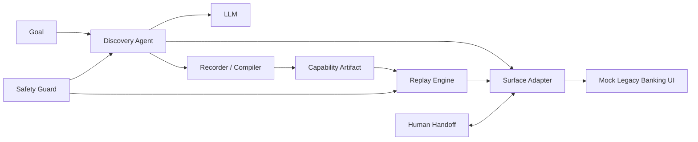

# Codex Implementation Brief — interface.ai Take-Home Project

## Your role

You are the primary implementation agent for this repository.

Build a complete, runnable submission for the interface.ai take-home assignment: **Computer-Use Automation System**.

Do not overbuild. Optimize for a **small, correct, end-to-end vertical slice** that demonstrates strong engineering judgment.

The final repository must be understandable and defensible by the candidate. Prefer clear code, explicit abstractions, typed data models, and documented trade-offs over framework complexity.

---

# 1. Core product idea

Build a system where:

1. A user gives a **natural-language goal** and a target app.
2. An **LLM-driven discovery agent** observes and operates a real UI until the goal succeeds or stops.
3. The successful run is converted into a **typed, versioned, reusable capability artifact**.
4. A **deterministic replay engine** executes that artifact later with new parameters, **without an LLM in the decision loop**.
5. Replay returns structured results and distinguishes:
   - success,
   - legitimate business outcomes,
   - recoverable conditions,
   - hard failures.
6. The system enforces safety policies and redaction.
7. When automation cannot safely continue, it can pause and allow a **human to take over the same live browser session**, then resume.

The most important design areas are:
- artifact schema,
- deterministic replay,
- robust targeting,
- error taxonomy,
- safety,
- human handoff,
- clean abstraction between capability definition and concrete UI technology.

---

# 2. Scope

Implement one concrete browser-based surface.

Do NOT build:
- distributed systems,
- queues,
- Kubernetes,
- a real multi-tenant backend,
- a full operator dashboard,
- desktop automation,
- a polished frontend,
- a production banking system.

Instead, implement a thin but real version of every required capability.

---

# 3. Technology choices

Use:

- Python
- FastAPI
- Jinja2 templates
- Playwright
- Pydantic
- JSON for saved capability artifacts
- JSONL for structured logs
- python-dotenv
- official OpenAI Python SDK for the initial LLM provider, behind an abstraction

Do NOT use LangChain or LangGraph unless there is a very strong reason. The core logic should remain easy to inspect.

Use an interface/adapter pattern so another LLM provider could be added later.

---

# 4. Repository structure

Refactor the current repository into approximately:

```text
interface-ai-assignment/

├── app/
│   ├── __init__.py
│   ├── main.py
│   ├── data.py
│   ├── templates/
│   │   ├── index.html
│   │   ├── member_detail.html
│   │   └── error.html
│   └── static/
│
├── computer_use/
│   ├── __init__.py
│   ├── schema.py
│   ├── llm.py
│   ├── observer.py
│   ├── surface.py
│   ├── executor.py
│   ├── recorder.py
│   ├── discovery.py
│   ├── replay.py
│   ├── safety.py
│   ├── handoff.py
│   ├── logging_utils.py
│   └── redaction.py
│
├── artifacts/
│
├── evidence/
│
├── tests/
│   ├── test_schema.py
│   ├── test_safety.py
│   └── test_replay_results.py
│
├── discover.py
├── replay.py
├── requirements.txt
├── .env.example
├── .gitignore
├── README.md
└── REPORT.md
```

Small deviations are okay if they improve clarity.

---

# 5. Build a local mock legacy banking app

Create a local FastAPI app representing a fictional credit union employee servicing console.

The purpose is to provide a realistic proxy for an old bank back-office UI.

## Required behavior

Landing page:

```text
COMMUNITY CREDIT UNION
Employee Servicing Console

Member Lookup

Member Number: [____________]

[ Search ]
```

Support fake records such as:

```text
10001 -> Alice Chen -> Checking 2340.10, Savings 4250.32
10002 -> Bob Smith -> Checking 1520.00, Savings 8921.10
10003 -> Maria Lee -> Checking 780.45, no savings account
20001 -> permission denied
99999 -> member not found
```

## Legacy-style characteristics

Make the UI intentionally somewhat hostile to clean automation, but not ridiculous.

Use at least 2 of the following:
- iframe or nested iframe,
- table-based layout,
- no `data-testid`,
- generic/non-semantic element structure,
- legacy-style form submission,
- weak CSS classes.

Avoid stable element IDs that trivialize replay.

The page should still be usable by a human.

## Error/exception behavior

Support deterministic test cases:

- `99999` -> MEMBER_NOT_FOUND
- `20001` -> PERMISSION_DENIED
- `10003` -> NO_SAVINGS_ACCOUNT
- one explicit route/query/input that creates a transient or simulated load condition
- one explicit route/query/input that triggers an unexpected dialog or blocker for human handoff

Do not make important test behavior random unless randomness is seeded/configurable.

---

# 6. Surface abstraction

Create a clean abstraction between the agent/replay system and Playwright.

Example conceptual interface:

```python
class SurfaceAdapter(Protocol):
    def observe(self) -> Observation: ...
    def execute(self, action: Action) -> ActionResult: ...
    def screenshot(self, path: str) -> str: ...
    def current_url(self) -> str: ...
```

Initial concrete implementation:

```text
PlaywrightSurface
```

The capability artifact must NOT be tightly coupled to raw Playwright selectors.

The design should make it credible to add later:

```text
AccessibilitySurface
ScreenshotCoordinateSurface
DesktopSurface
```

without rewriting the artifact schema.

---

# 7. Observation model

The discovery agent should receive a compact, structured description of the current UI.

Prefer semantic/accessibility information over raw HTML.

An observation may contain:

```json
{
  "url": "http://127.0.0.1:8000/",
  "title": "Community Credit Union",
  "elements": [
    {
      "ref": "e1",
      "role": "textbox",
      "name": "Member Number",
      "value": ""
    },
    {
      "ref": "e2",
      "role": "button",
      "name": "Search"
    }
  ],
  "visible_text": "...",
  "dialog_present": false
}
```

The LLM should reason from this representation.

Do not send huge raw HTML dumps unless necessary.

A screenshot may be captured for evidence/failure diagnosis, but the initial discovery loop does not need to rely purely on coordinates.

---

# 8. LLM discovery loop

Implement a real loop:

```text
goal
  ->
observe
  ->
LLM decide
  ->
validate action against policy
  ->
execute
  ->
record
  ->
observe again
  ->
...
```

Stopping conditions:
- goal complete,
- max steps,
- timeout,
- dead-end,
- safety block,
- human escalation.

The LLM must output a structured action.

Suggested action model:

```python
class Action(BaseModel):
    action_type: Literal[
        "click",
        "type",
        "extract",
        "navigate",
        "wait",
        "finish",
        "escalate"
    ]
    target: Target | None = None
    value: str | None = None
    output_name: str | None = None
    reason: str
```

Do not allow the LLM to execute arbitrary Python or shell commands.

The LLM proposes an action; the executor performs it.

---

# 9. Target / locator model

This is a central design point.

Do NOT make the artifact store only a brittle CSS selector.

Use a semantic target representation.

Suggested model:

```python
class Target(BaseModel):
    role: str | None = None
    name: str | None = None
    text: str | None = None
    near_text: str | None = None
    frame_hint: str | None = None
    fallbacks: list["LocatorHint"] = []
```

Suggested locator priority:

1. accessibility role + accessible name,
2. associated label,
3. visible text,
4. relative/near-text relationship,
5. narrowly scoped CSS/XPath fallback only if needed.

The surface adapter resolves the abstract target into a concrete Playwright locator at runtime.

Record enough target information for deterministic replay.

---

# 10. Capability artifact schema

This is one of the most important parts of the entire submission.

Create a typed, serializable, versioned schema using Pydantic.

At minimum include:

```python
class Capability(BaseModel):
    schema_version: str
    capability_id: str
    name: str
    description: str

    target_app: TargetApp

    inputs: list[InputSpec]
    outputs: list[OutputSpec]

    steps: list[CapabilityStep]

    success_condition: Checkpoint

    business_outcomes: list[BusinessOutcomeSpec]

    safety_policy: SafetyPolicy

    metadata: CapabilityMetadata
```

Each input/output must be typed.

Example:

```json
{
  "schema_version": "1.0",
  "capability_id": "lookup_savings_balance",
  "name": "Lookup Savings Balance",
  "description": "Look up a member and return their savings balance.",

  "target_app": {
    "app_id": "mock_credit_union",
    "entry_point": "http://127.0.0.1:8000/"
  },

  "inputs": [
    {
      "name": "member_id",
      "type": "string",
      "required": true
    }
  ],

  "outputs": [
    {
      "name": "savings_balance",
      "type": "number",
      "required": false
    }
  ]
}
```

---

# 11. Parameterization

The recorded discovery run may use a concrete value:

```text
10001
```

but the saved capability must generalize it into:

```text
{{member_id}}
```

The artifact must not hardcode the discovery-run member ID.

Example step:

```json
{
  "id": "step_1",
  "action": "type",
  "target": {
    "role": "textbox",
    "name": "Member Number"
  },
  "value": "{{member_id}}",
  "checkpoint": {
    "type": "value_equals",
    "expected": "{{member_id}}"
  }
}
```

Create a simple, explicit parameter substitution mechanism.

Do not use `eval`.

---

# 12. Capability step model

A step should contain at least:

```python
class CapabilityStep(BaseModel):
    id: str
    action: ActionType
    target: Target | None
    value: str | None
    output_name: str | None
    checkpoint: Checkpoint | None
    timeout_ms: int = 5000
```

Optionally include retry policy.

Keep the schema understandable.

---

# 13. Checkpoints / success conditions

Replay must verify that actions actually produced the expected state.

Support a small set of checkpoint types, for example:

```text
element_visible
text_visible
url_matches
value_equals
any_of
all_of
output_extracted
```

Examples:

```json
{
  "type": "any_of",
  "conditions": [
    {
      "type": "text_visible",
      "value": "Savings Account"
    },
    {
      "type": "text_visible",
      "value": "Member not found"
    },
    {
      "type": "text_visible",
      "value": "Permission denied"
    }
  ]
}
```

Keep this typed.

---

# 14. Recorder / compiler

A successful discovery run produces a raw trajectory.

Do NOT save the raw LLM transcript as the final capability.

Create a recorder/compiler layer that converts successful actions into the typed artifact.

The output must be:
- reviewable,
- parameterized,
- decoupled from the raw model conversation,
- reusable by replay.

For the demo capability, ensure the resulting artifact is clean and human-readable.

---

# 15. Deterministic replay

Create a replay engine that accepts:

```text
artifact path
+
runtime input parameters
```

Example CLI:

```bash
python replay.py \
  --artifact artifacts/lookup_savings_balance.json \
  --member-id 10002
```

Replay must:

1. load and validate the artifact,
2. validate runtime inputs,
3. open the target app,
4. execute saved steps in order,
5. use the semantic locator strategy,
6. perform checkpoints,
7. extract declared outputs,
8. classify final result,
9. write logs/evidence,
10. NEVER ask the LLM what action to perform.

It is okay if replay imports LLM-related modules as long as no model call is made.

Prefer architecture that makes model-free replay obvious.

---

# 16. Result contract / error taxonomy

Create a typed structured result.

Suggested statuses:

```python
class RunStatus(str, Enum):
    SUCCESS = "success"
    BUSINESS_OUTCOME = "business_outcome"
    RECOVERABLE_ERROR = "recoverable_error"
    HARD_FAILURE = "hard_failure"
    ESCALATED = "escalated"
```

Suggested result:

```python
class RunResult(BaseModel):
    status: RunStatus
    capability_id: str | None = None
    outputs: dict[str, Any] = {}
    business_outcome: str | None = None
    failed_step_id: str | None = None
    message: str | None = None
    evidence: list[str] = []
```

Required demo cases:

```text
10002
-> SUCCESS
-> savings_balance = 8921.10

99999
-> BUSINESS_OUTCOME
-> MEMBER_NOT_FOUND

10003
-> BUSINESS_OUTCOME
-> NO_SAVINGS_ACCOUNT

20001
-> BUSINESS_OUTCOME or HARD_FAILURE
```

Choose the classification for `PERMISSION_DENIED`, justify it, and use it consistently.

Also demonstrate a recoverable transient condition if reasonable.

---

# 17. Retry / recoverable conditions

Implement a small retry policy for recoverable issues such as:

- timeout,
- slow load,
- known dismissible interstitial.

Do not build a complex workflow engine.

Example:

```text
max retries: 2
backoff: small fixed or exponential delay
```

Log every retry.

If recovery fails, return a clear hard failure or escalate.

---

# 18. Safety guardrails

Create an explicit configurable policy.

Example:

```python
class SafetyPolicy(BaseModel):
    allowed_hosts: list[str]
    allowed_actions: list[ActionType]
    blocked_routes: list[str] = []
    require_human_for_risk: list[RiskLevel] = []
```

Initial config should allow only:

```text
localhost
127.0.0.1
```

Allowed actions:

```text
click
type
extract
navigate
wait
finish
escalate
```

Classify actions by risk, for example:

```text
READ
SAFE_WRITE
IRREVERSIBLE
```

Risky/irreversible actions should be blocked or require human confirmation.

The safety layer must validate actions before execution.

---

# 19. Redaction

Artifacts and logs must not persist:
- API keys,
- tokens,
- passwords,
- raw credentials,
- full sensitive PII.

Implement a simple redaction utility.

For example mask:
- environment-secret values,
- obvious token patterns,
- passwords,
- authorization headers.

Fake member IDs in the mock app are safe synthetic data, but keep the design realistic.

---

# 20. Structured logging / evidence

Use JSONL logs.

Each event should include fields such as:

```json
{
  "timestamp": "...",
  "run_id": "...",
  "phase": "discovery",
  "event": "action_executed",
  "step": 2,
  "action": "click",
  "reason": "...",
  "status": "ok"
}
```

Save evidence under:

```text
/evidence/
```

Need examples for:
- one successful discovery run,
- one successful replay,
- one replay hitting a business outcome or failure,
- at least one screenshot on failure/escalation.

Do not commit API keys.

---

# 21. Human-in-the-loop handoff

Implement a minimal but real mechanism.

Use Playwright with a visible browser:

```text
headless=False
```

When discovery or replay cannot safely continue:

1. automation pauses,
2. same browser context/session remains open,
3. print a clear intervention request,
4. capture screenshot and context,
5. mark control owner as `human`,
6. let the human interact with that same browser window,
7. wait for the user to press ENTER in the terminal,
8. mark control owner back as `automation`,
9. re-observe state,
10. continue or complete.

Suggested control state:

```python
class ControlOwner(str, Enum):
    AUTOMATION = "automation"
    HUMAN = "human"
```

Log:

```text
handoff_requested
control_transferred_to_human
human_intervention_completed
control_returned_to_automation
```

The human action history may be summarized rather than perfectly instrumented, but the session/control-transfer mechanism must be real.

Create one deterministic demo blocker so the handoff can be tested reliably.

---

# 22. LLM provider abstraction

Create:

```python
class LLMClient(Protocol):
    def decide(self, goal: str, observation: Observation, history: list[...]) -> Action:
        ...
```

Implement an OpenAI-backed client.

Load credentials from:

```text
OPENAI_API_KEY
OPENAI_MODEL
```

through `.env`.

Add `.env.example`:

```text
OPENAI_API_KEY=
OPENAI_MODEL=
```

Do not hardcode a model name in many files.

If the official SDK supports structured response parsing cleanly, use it.

Otherwise:
- ask for JSON,
- parse defensively,
- validate through Pydantic,
- retry malformed output once.

---

# 23. Discovery prompt behavior

The model should receive:

- the goal,
- compact current observation,
- allowed actions,
- safety constraints,
- recent step history,
- stopping instructions.

The prompt should strongly instruct:

- choose exactly one next action,
- never invent unavailable controls,
- prefer semantic targets,
- finish only when success is actually observed,
- escalate if unsafe or blocked.

Do not put secrets in the prompt.

---

# 24. CLI

Create simple CLIs.

## Start mock app

```bash
uvicorn app.main:app --reload
```

## Discovery

Example:

```bash
python discover.py \
  --goal "Look up member 10001 and return their savings balance" \
  --target http://127.0.0.1:8000/
```

Expected:
- launches visible Chromium,
- LLM performs actions,
- goal succeeds,
- capability artifact saved,
- discovery log written.

## Replay

```bash
python replay.py \
  --artifact artifacts/lookup_savings_balance.json \
  --member-id 10002
```

Expected:
- visible Chromium,
- no model decision calls,
- returns savings balance,
- replay log written.

Add helpful CLI usage/errors.

---

# 25. Recommended end-to-end demo

The main demo capability should be:

```text
lookup_savings_balance(member_id: string) -> savings_balance: number
```

Discovery run:

```text
member_id = 10001
```

Replay run:

```text
member_id = 10002
```

Business outcome replay:

```text
member_id = 99999
```

Human escalation demo:

Use a deterministic query/member/test condition that creates an unexpected blocking dialog.

The exact handoff demo can be separate from the primary capability if needed.

---

# 26. Tests

Add a small number of useful tests.

At minimum:

1. capability schema round-trip:
   - create,
   - serialize,
   - deserialize,
   - validate.

2. safety:
   - allowed localhost action passes,
   - external domain action is blocked.

3. result taxonomy:
   - expected business outcome remains distinct from hard failure.

4. parameter substitution:
   - `{{member_id}}` resolves safely.

Do not spend hours on test breadth.

---

# 27. README.md requirements

README must include:

## Project summary

Explain in 3–5 sentences:

```text
LLM discovers a workflow once.
The successful trajectory is compiled into a typed capability artifact.
Replay executes the capability deterministically without an LLM.
The system includes checkpoints, error taxonomy, guardrails, evidence, and human handoff.
```

## Architecture diagram

Use a Mermaid diagram or ASCII diagram.

Suggested:



## Setup

Document:

```bash
python -m venv .venv
source .venv/bin/activate
pip install -r requirements.txt
playwright install chromium
cp .env.example .env
```

## Run app

```bash
uvicorn app.main:app --reload
```

## Run discovery

Exact command.

## Run replay

Exact command.

## Demo cases

List test member IDs and expected behavior.

## Repository layout

Short explanation.

## Security

Explain:
- fake data only,
- no real credentials,
- local allowlist,
- secret redaction,
- `.env` ignored.

---

# 28. REPORT.md requirements

Keep it approximately 1–3 pages of dense, useful writing.

Use exactly these seven headings:

# 1. Architecture

Explain:
- discovery vs replay separation,
- SurfaceAdapter,
- policy layer,
- recorder/compiler,
- evidence/logging,
- why the design is deliberately small.

# 2. Artifact schema

Explain:
- typed/versioned capability,
- inputs/outputs,
- semantic targets,
- checkpoints,
- parameterization,
- why artifact is not raw transcript,
- why artifact does not directly encode Playwright selectors.

# 3. Determinism & error handling

Explain:
- model-free replay,
- stable semantic locator strategy,
- waits/checkpoints,
- retry policy,
- business outcome vs recoverable vs hard failure,
- what kinds of UI drift are and are not handled.

# 4. Heterogeneity & multi-tenant

Design only.

Explain future seam:

```text
SurfaceAdapter
├── Browser/Playwright
├── Accessibility
├── Screenshot/coordinates
└── Desktop
```

Explain cross-tenant reuse:

- base vendor capability,
- tenant-specific configuration/overrides,
- app version metadata,
- locator overrides,
- validation/stability checks.

Do NOT claim this is implemented.

# 5. Escalation & handoff

Explain:
- stuck detection,
- same live session,
- control-owner state,
- pause/human/resume,
- evidence preserved.

# 6. Safety

Explain:
- host/action allowlist,
- action risk classification,
- irreversible actions,
- secret/PII redaction,
- local fake app,
- limitations.

# 7. Cuts

Be explicit.

Examples:

- no desktop adapter implemented,
- no real bank system,
- no multi-tenant infrastructure,
- no full co-browsing console,
- no production authorization,
- no distributed worker architecture,
- no automatic artifact approval workflow.

Then say what would come next.

---

# 29. Evidence directory

After implementation, generate and keep representative evidence.

Suggested:

```text
evidence/
├── discovery_success.jsonl
├── replay_success.jsonl
├── replay_business_outcome.jsonl
├── handoff.jsonl
├── artifact_lookup_savings_balance.json
├── failure_or_handoff.png
└── README.md
```

If API access is unavailable during implementation, leave scripts ready and clearly document which evidence requires a live model call.

But before considering the assignment complete, perform at least one genuine LLM-driven discovery run.

---

# 30. requirements.txt

Keep dependencies modest.

Likely:

```text
fastapi
uvicorn[standard]
jinja2
playwright
pydantic
python-dotenv
openai
```

Add only what is actually needed.

Pin versions if practical after validating the environment.

---

# 31. .gitignore

Must ignore:

```text
.venv/
.env
__pycache__/
*.pyc
.pytest_cache/
.idea/
```

Do NOT ignore:
- artifacts intended for review,
- sanitized evidence,
- README,
- REPORT.

---

# 32. Quality constraints

Follow these rules:

- Use type hints.
- Use Pydantic for external/serialized contracts.
- Keep modules small and obvious.
- Avoid hidden magic.
- Avoid unnecessary inheritance.
- Avoid framework-heavy abstractions.
- Never use `eval` or `exec`.
- Never commit secrets.
- Never automate a real bank website.
- Use only fake/synthetic banking data.
- Make model-free replay structurally obvious.
- Keep the public artifact human-readable.
- Add comments only where they explain non-obvious design decisions.
- Prefer deterministic test behavior.
- Preserve explainability.

---

# 33. Acceptance checklist

Do not declare the project complete until all of these are true.

## Mock app
- [ ] Local legacy-style banking UI runs.
- [ ] Multi-step workflow exists.
- [ ] At least two legacy characteristics exist.
- [ ] Fake success and error states exist.

## Discovery
- [ ] Goal + target accepted.
- [ ] Real LLM call performed.
- [ ] Observe -> decide -> act loop works.
- [ ] Real UI interaction happens.
- [ ] Stop conditions exist.
- [ ] Raw trajectory is recorded.

## Artifact
- [ ] Typed.
- [ ] Versioned.
- [ ] Serializable.
- [ ] Parameterized.
- [ ] Contains inputs.
- [ ] Contains outputs.
- [ ] Contains ordered steps.
- [ ] Contains semantic target descriptions.
- [ ] Contains checkpoints/success condition.
- [ ] Contains business outcome definitions.

## Replay
- [ ] No LLM decisions.
- [ ] New input parameter works.
- [ ] Checkpoints verified.
- [ ] Outputs returned.
- [ ] Business outcome classified.
- [ ] Recoverable handling exists.
- [ ] Hard failure includes debugging context.

## Safety
- [ ] Domain allowlist.
- [ ] Action allowlist.
- [ ] Risk classification.
- [ ] Secret redaction.
- [ ] No real PII.

## Human handoff
- [ ] Detect blocker.
- [ ] Pause automation.
- [ ] Preserve same browser session.
- [ ] Give control to human.
- [ ] Resume after human action.
- [ ] Log transition.

## Evidence
- [ ] Discovery log.
- [ ] Replay log.
- [ ] Error/business outcome log.
- [ ] Screenshot on failure/handoff.
- [ ] Example artifact.

## Documentation
- [ ] README setup.
- [ ] README exact demo commands.
- [ ] REPORT with seven required headings.
- [ ] Cuts clearly documented.

---

# 34. Implementation order

Work in this order.

## Phase 1 — skeleton

Create:
- folders,
- requirements,
- `.env.example`,
- `.gitignore`,
- basic Pydantic schema.

## Phase 2 — mock legacy app

Build and manually verify the fake banking UI.

## Phase 3 — Playwright surface

Implement:
- launch,
- navigate,
- observe,
- semantic target resolution,
- click,
- type,
- extract,
- screenshot.

## Phase 4 — LLM discovery

Implement:
- OpenAI client abstraction,
- structured action generation,
- observe/decide/act loop,
- safety validation,
- structured logs.

## Phase 5 — recorder/compiler

Convert successful trajectory into:
- typed,
- parameterized,
- human-readable capability JSON.

## Phase 6 — deterministic replay

Implement:
- artifact validation,
- parameter resolution,
- model-free execution,
- checkpoints,
- outputs,
- result contract,
- error taxonomy.

## Phase 7 — safety + handoff

Add:
- allowlists,
- risk model,
- redaction,
- pause/human/resume same-session handoff.

## Phase 8 — tests + evidence

Run:
- success discovery,
- success replay,
- business outcome,
- handoff/failure.

Save sanitized evidence.

## Phase 9 — documentation

Finish:
- README,
- REPORT.

---

# 35. Important reasoning requirements

When making implementation decisions, prefer the decision that is easiest to justify to an engineering reviewer.

In particular:

### Why not pure screenshot coordinates?

Because the current proxy app is browser-based and semantic/accessibility targeting gives stronger replay reliability, while SurfaceAdapter keeps open the path to screenshot/coordinate or OS-level surfaces later.

### Why not raw CSS selectors?

Because the real environment may have poor DOMs and different tenant/vendor variants. The artifact should describe controls semantically and let a surface-specific resolver map them to runtime locators.

### Why compile a capability instead of replaying the LLM transcript?

Because production invocation should be deterministic, reviewable, cheap, versioned, parameterized, and independent of the model.

### Why keep human handoff simple?

Because the requirement is the control-transfer seam, not a polished operator console. A visible same-session browser plus pause/resume demonstrates the real mechanism.

### Why use a local mock bank?

Because it allows safe synthetic data, controlled exception states, no ToS risk, and realistic legacy UI characteristics.

---

# 36. What NOT to do

Do not:
- create a gorgeous React frontend,
- use a real banking login,
- create dozens of capabilities,
- build queues/services/microservices,
- add LangGraph just to name-drop it,
- generate a giant codebase,
- use brittle hardcoded coordinates as the only targeting strategy,
- store raw LLM transcripts as the final artifact,
- let deterministic replay ask the model what to do,
- silently treat MEMBER_NOT_FOUND as an exception,
- write vague TODOs for handoff instead of implementing the control transfer,
- commit API keys,
- claim unimplemented multi-tenant or desktop functionality is working.

---

# 37. Final completion behavior

After implementing, do all of the following:

1. Run unit tests.
2. Run the local app.
3. Run one genuine discovery.
4. Save the generated capability.
5. Run deterministic replay with a different member ID.
6. Run at least one business-outcome case.
7. Run or simulate the human-handoff demo.
8. Save sanitized evidence.
9. Review README commands for correctness.
10. Review REPORT claims against actual implementation.
11. Print a concise final summary containing:
   - what was built,
   - exact commands to demo it,
   - files that matter most,
   - known cuts/limitations,
   - any remaining manual step I must perform before submission.

Do not stop after scaffolding. Continue until the repository is in a submission-ready state, unless blocked by credentials or an unrecoverable environment issue.
