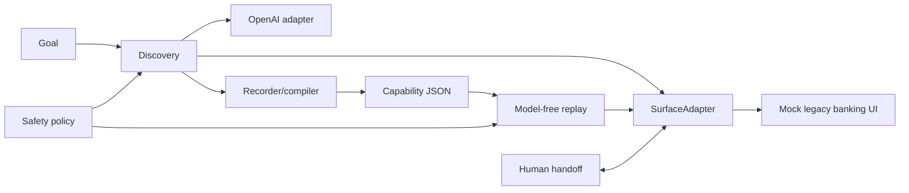

# Computer-Use Automation System

This project demonstrates a small end-to-end browser automation system for a synthetic legacy credit-union console. An LLM discovers a workflow once from compact UI observations; the successful trajectory is compiled into a typed, versioned capability artifact. Later replay executes that artifact deterministically without an LLM in the decision loop. Checkpoints, business-outcome classification, safety policy, redacted JSONL evidence, and same-session human handoff are included.

## Architecture



## Setup

```bash
python -m venv .venv
source .venv/bin/activate
pip install -r requirements.txt
playwright install chromium
cp .env.example .env
```

Put an OpenAI key and optional model in `.env` only when running discovery. `.env` is ignored by Git.

## Run the mock app

```bash
uvicorn app.main:app --reload
```

Open `http://127.0.0.1:8000/`. It is intentionally table-based and uses an iframe. All records are synthetic.

## Run discovery

With the app running and `OPENAI_API_KEY` configured:

```bash
python discover.py \
  --goal "Look up member 10001 and return their savings balance" \
  --target http://127.0.0.1:8000/
```

This uses a visible Chromium window and writes `artifacts/lookup_savings_balance.json` plus a JSONL discovery log. The compiler parameterizes the concrete discovery value as `{{member_id}}`.

## Run deterministic replay

```bash
python replay.py --artifact artifacts/lookup_savings_balance.json --member-id 10002
python replay.py --artifact artifacts/lookup_savings_balance.json --member-id 99999
```

Expected results are `SUCCESS` with `savings_balance: 8921.1`, and `BUSINESS_OUTCOME` with `MEMBER_NOT_FOUND`, respectively. `10003` produces `NO_SAVINGS_ACCOUNT`; `20001` produces `PERMISSION_DENIED` (a legitimate business outcome because the console explicitly reports an access decision, rather than an automation fault).

## Demo inputs

| Member | Expected result |
|---|---|
| `10001` | Alice Chen, savings `$4250.32` |
| `10002` | Bob Smith, savings `$8921.10` |
| `10003` | `NO_SAVINGS_ACCOUNT` |
| `20001` | `PERMISSION_DENIED` |
| `99999` | `MEMBER_NOT_FOUND` |
| `30000` | transient busy state |
| `40000` | deterministic dialog blocker for handoff |

## Tests

```bash
python -m pytest -q
```

## Repository layout

`app/` is the local mock UI. `computer_use/` contains typed contracts, the Playwright surface, policy, discovery, compiler, replay, handoff, and logging. `artifacts/` stores reviewable capabilities; `evidence/` stores sanitized run logs/screenshots; `tests/` covers schema, safety, substitution, and result taxonomy.

## Security

The banking data is fake and local; no real banking site or PII is automated. Navigation is restricted to `localhost` and `127.0.0.1`, and actions are allowlisted. Logs redact environment secrets, token-like strings, passwords, and authorization values. `.env` is ignored and no API key belongs in artifacts or evidence. This is a demonstration policy, not production authorization.
