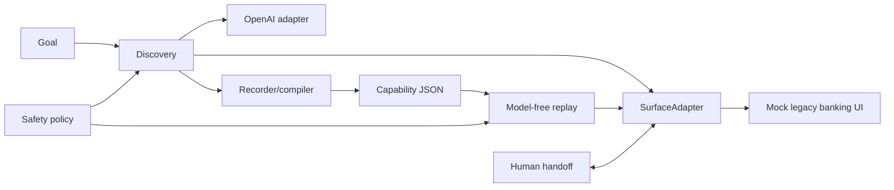

# Computer-Use Automation System

This project demonstrates a small end-to-end browser automation system for a synthetic legacy credit-union console. An LLM discovers a workflow once from compact UI observations; the successful trajectory is compiled into a typed, versioned capability artifact. Later replay executes that artifact deterministically without an LLM in the decision loop. Checkpoints, business-outcome classification, safety policy, redacted JSONL evidence, and same-session human handoff are included.

## Architecture



## Setup

```bash
python -m venv .venv
source .venv/bin/activate
pip install -r requirements.txt
playwright install chromium
cp .env.example .env
```

Put `OPENAI_API_KEY` and optional `OPENAI_MODEL` in `.env` only when running discovery.
Keep `.env.example` empty of credentials. Copy it only on first setup so that an
existing `.env` is not overwritten. Replay does not require an API key.
Visible browser demos require a working graphical display (for example WSLg on WSL).

## Run the mock app

```bash
uvicorn app.main:app --host 127.0.0.1 --port 8000 --reload
```

Open `http://127.0.0.1:8000/`. It is intentionally table-based and uses an iframe. All records are synthetic.

## Run discovery

With the app running and `OPENAI_API_KEY` configured:

```bash
python discover.py \
  --goal "Look up member 10001 and return their savings balance" \
  --target http://127.0.0.1:8000/
```

Run discovery in a second terminal with the virtual environment activated. It uses
a visible Chromium window. Success requires an executed `extract` with
`output_name="savings_balance"`, a Savings Account target and visible page label,
and a complete money value such as `$4250.32` or `$0.00`. A name, member number,
business-error page, or bare `finish` does not pass. Rejections are fed back to the
model; the loop stops after at most 12 actions if no verified balance is obtained.

On success it writes:

- `artifacts/lookup_savings_balance.json`: reusable capability.
- `evidence/discovery_trajectory.json`: the trajectory consumed by the compiler.
- `evidence/discovery_success.jsonl`: append-only events, including failed attempts.

The compiler derives ordered steps and targets from executed trajectory actions,
filters unsuccessful actions, deduplicates repeated extraction targets, and maps
the first typed value to `{{member_id}}`. It normalizes the single output name and
preserves action risk. Metadata, business outcomes and checkpoint templates remain
specific to this savings lookup demo; this is not a general workflow compiler.
Rerun discovery after compiler changes to regenerate the artifact.

## Run deterministic replay

```bash
python replay.py --artifact artifacts/lookup_savings_balance.json --member-id 10002
python replay.py --artifact artifacts/lookup_savings_balance.json --member-id 99999
```

Expected results are `SUCCESS` with `savings_balance: 8921.1`, and `BUSINESS_OUTCOME` with `MEMBER_NOT_FOUND`, respectively. `10003` produces `NO_SAVINGS_ACCOUNT`; `20001` produces `PERMISSION_DENIED` (a legitimate business outcome because the console explicitly reports an access decision, rather than an automation fault).

## Demo inputs

| Member | Expected result |
|---|---|
| `10001` | Alice Chen, savings `$4250.32` |
| `10002` | Bob Smith, savings `$8921.10` |
| `10003` | `NO_SAVINGS_ACCOUNT` |
| `20001` | `PERMISSION_DENIED` |
| `99999` | `MEMBER_NOT_FOUND` |
| `30000` | persistent busy state: three retries, then human handoff |
| `40000` | deterministic dialog blocker for handoff |

## Retry and human handoff

To exercise retry exhaustion, run with the app running:

```bash
python replay.py --artifact artifacts/lookup_savings_balance.json --member-id 30000
```

Expect three retry messages after the initial submission, then a terminal pause.
In the same browser, query synthetic member `10002`, then press ENTER in the terminal
to resume. Clicks, committed input changes, form submissions and frame navigations
are automatically logged during human control, including inside iframes and after
navigation. Input values are omitted, and event URLs omit queries and fragments.
The log stores browser events and before/after observations, with
screenshots linked from each event. Text is redacted at the logging boundary;
screenshots are unredacted and intended only for this synthetic app. Do not enter
real personal data or credentials. `CI_AUTO_HANDOFF=1` is a simulation bypass and
its events explicitly indicate that no human actions were recorded. Native browser
dialogs and browser chrome are not instrumented; this is not a complete OS audit.
This manually changes the demo lookup subject; it is not evidence that member `30000`
has that balance. Logs are in `evidence/handoff.jsonl`. With `--headless`, exhaustion
returns `escalated` because a visible browser is required for intervention.

`30000` always returns busy: it demonstrates exhaustion, not eventual recovery.
There are at most four submissions (the initial one plus three retries); each retry
restores the original member input. This recovery also handles Playwright timeouts
for the recognized read-only lookup submission. Other actions are not automatically
resubmitted under this policy. After intervention, checkpoints must still pass.

For a dialog blocker that goes directly to handoff:

```bash
python replay.py --artifact artifacts/lookup_savings_balance.json --member-id 40000
```

The surface dismisses the native dialog and flags it for handoff. Once the terminal
pauses, interact with the same browser and press ENTER when done. No written action
summary is required. Inspect the recorded actions and retry events with:

```bash
tail -30 evidence/handoff.jsonl
```

`human_action` events include a sequence number, target description or navigation
URL, and `handoff_id`. Before/after screenshots are linked from handoff events.
The `human_intervention_completed` record identifies the source as `browser_events`.
These events are a partial browser audit, not a full recording of every interaction.

## Result semantics

- `success`: required success checkpoint passed.
- `business_outcome`: a declared member servicing outcome matched.
- `hard_failure`: execution/checkpoint failure or a blocked risk policy.
- `escalated`: Replay needs human intervention but was launched headless.
- `recoverable_error`: reserved in the schema; currently not returned. Known
  transient conditions are handled internally through retry and handoff.

## Tests

```bash
python -m pytest -q
```

Tests cover schema and substitution, discovery success rejection, risk propagation,
bounded recovery and handoff logging. Most behavior tests use simulated surfaces;
passing them does not substitute for the live discovery/replay commands above.

## Repository layout

`app/` is the local mock UI. `discover.py` is the discovery CLI; `replay.py` contains
the replay engine and CLI. `computer_use/` contains contracts, discovery,
`recorder.py`, `success.py`, `surface.py`, `safety.py`, `recovery.py`,
`handoff.py`, `human_tracking.py`, and logging utilities. `artifacts/` stores
reviewable capabilities; `evidence/` stores trajectories, logs and screenshots.

## Security

The banking data is synthetic. The action policy defaults to `localhost` and
`127.0.0.1` and a limited action vocabulary. `Action.risk` is preserved in
`CapabilityStep.risk` and passed back to safety validation during replay. Effective
risk is the highest of declared risk, semantic inference and configured
`SafetyPolicy.target_risks` (case-insensitive exact label matches).

Search clicks have a READ baseline; other clicks and typing have at least
SAFE_WRITE risk. Labels such as Delete Account raise a click to IRREVERSIBLE even
when it declares READ. The default policy blocks IRREVERSIBLE actions before
execution. Pressing ENTER after handoff does not grant risky-action authorization.
These label rules are demo heuristics, not production authorization or a network
sandbox; initial navigation, redirects and browser subrequests are not all guarded.

JSONL logging redacts the configured OpenAI key and common secret patterns. Human
event payloads omit input values, but observations, raw trajectory JSON and screenshots
are not a comprehensive PII-safe capture pipeline. Use only synthetic data.
`.env` is ignored; do not place credentials in `.env.example` or reviewable evidence.

## Scope and limitations

`PlaywrightSurface` is tailored to the mock console's Member Lookup iframe and
table layout. It uses DOM/semantic targeting, not screenshot-based model decisions.
Additional adapters, a general legacy-browser engine, complete human keystroke
auditing and production authorization are not implemented. See `REPORT.md` for
the abstraction boundaries and remaining cuts.
